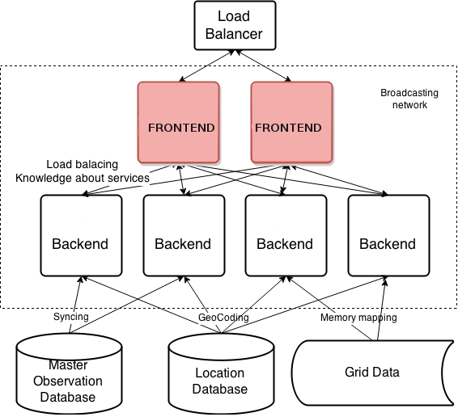
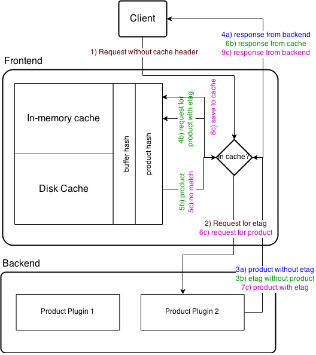
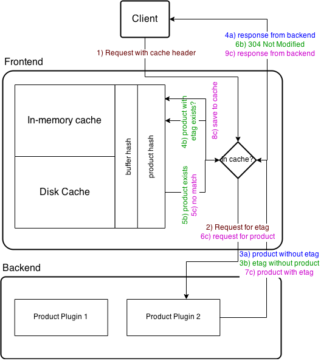

# SmartMet Server

[SmartMet Server](https://github.com/fmidev/smartmet-server) is a data
and product server for MetOcean data. It provides a high capacity and
high availability data and product server for MetOcean data. The
server is written in C++, since 2008 it has been in operational use by
the Finnish Meteorological Institute FMI.

Table of Contents
=================

  * [Introduction](#introduction)
  * [Etags and Product Cache](#etags-and-product-cache)
  * [The frontend  plugin](#the-frontend--plugin)
  * [Configuration](#configuration)
    * [Activated filter list](#activated-filter-list)
    * [Cache for compressed replies](#cache-for-compressed-replies)
    * [Cache for uncompressed replies](#cache-for-uncompressed-replies)
    * [Filter definitions](#filter-definitions)

# Introduction

The frontend and the Sputnik engine form the outwardly visible part of
the Smartmet server clusters. The Sputnik engine distribute incoming
frontend connections for execution at the backend and frontend acts as
a cache for responses. Both the frontend and backend use the Sputnik
engine, whose configuration depends on whether it is on the frontend
or backend.

The figure below shows the architecture of the Smartmet server. It
consists of frontend and backend servers, load balancer, and database servers.

 

The frontend provides HTTP 1.1 server interface that supports chunked,
gzip and no encoding data. It monitors the status of the backend
services. The frontend forwards requests to the backend servers that
have the required services by considering the load on the backend
servers. At the frontend there are different queues for fast and slow
services. The frontend also caches the responses from the backend and
this speeds up the retrieval of products that are requested
frequently. The frontend caches the response using the Least Recently
Used (LRU) policy in the product cache.

# Etags and Product Cache 

The ETag or Entity Tag is a part of the HTTP protocol and it is one of
the mechanisms for web cache validation. ETags are optional entity in
the HTTP header. In the Smartmet server setting, the Etags works as
product hash and it consists of the requested URL, product configuration and
used data. If any of the above changes, the product is
depreciated. ETags are mapped into buffer hash and data is stored
based on the buffer hash. ETags and the product cache speeds up the
information retrieval of a product.

# The frontend  plugin

The frontend plugin interacts with the client and the backend when the
client sends a request to the frontend for a product.

When the client requests for a product without a cache header, the
frontend plugin sends this request to the backend to get the product
ETag. If the backend response is without ETag, the frontend  plugin delivers
the response to the client. If the backend responds with the ETag, the
frontend plugin checks whether the Etag exists in the product cache and if it
is, the frontend plugin  retrieves the information from the cache using the
buffer hash. If the ETag does not exist, the frontend plugin  requests the
product from the backend.

The figure below  describes the  cache functionality when the  request is
done without cache header.

If the client requests for a product with "if-modified-since" or
 "if-none-match" in the header, the frontend plugin requests to the
 backend for the product with the specific header to get the ETag. If
 the backend responds the content without ETag, the plugin does not
 support cache and the response is delivered to the client. If the
 backend responds with ETag, the frontend plugin checks whether the
 ETag exists in the cache. If yes, the plugin response is 304, i.e.,
 "Not Modified". If the ETag does not exist in the cache the plugin
 requests for the product from the backend.

The figure below  describes the  cache functionality when request is done with the  cache header.

#Configuration
The frontend plugin configures memory limits and which IPs are allowed
access to the services:

##Activated filter list
<pre><code>
filters = ["frontend","timeseries","autocomplete"];
</code></pre>

##Cache for compressed replies

<pre><code>
compressed_cache =
{
 memory_bytes     = 53687091200L; # 50GB
 filesystem_bytes = 107374182400L; # 100 GB                          
 directory        = "/brainstorm/cache/frontend-compressed-cache";
};
</code></pre>

## Cache for uncompressed replies

<pre><code>uncompressed_cache =
{
 memory_bytes = 53687091200L; # 50 GB
 filesystem_bytes        = 107374182400L; # 100 GB
 directory       = "/brainstorm/cache/frontend-uncompressed-cache";
};
</code></pre>

##Filter definitions
<pre><code>
frontend:
{
        handler         = "/admin";
        ip_filters      = ["*.*.*.*"];
};
</code></pre>
<pre><code>
timeseries:
{
        handler         = "/pointforecast";
        ip_filters      = ["*.*.*.*"];
};
</code></pre>

<pre><code>
autocomplete:
{
        handler         = "/autocomplete";
        ip_filters      = ["*.*.*.*"];
};
</code></pre>

